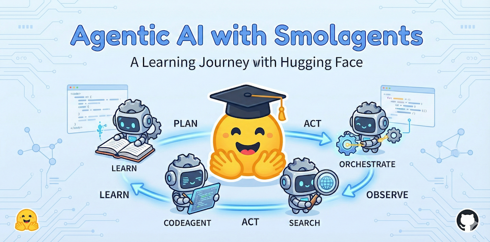

# Building AI Agents with smolagents



A short, self-guided lab sequence: six notebooks that take you from “what is an agent?” to a manager of specialist agents with traces you can compare.

Framework: [smolagents](https://github.com/huggingface/smolagents) (Hugging Face). The ideas — the agent loop, tools as a contract, code-as-action vs JSON-as-action, retrieval, decomposition, observability — apply to any agent stack.

This is **not** a replacement for the long official [Hugging Face Agents Course](https://huggingface.co/learn/agents-course). That course is the full curriculum. This repo is a **one-day lab track** you can finish and keep.

---

## Who this is for

You can read Python (functions, classes, a bit of `pandas`). You know, roughly, what a language model is.

You do **not** need prior smolagents, LangChain, or production ML experience.

If you want a gentler, longer path with videos and quizzes, start at the [HF Agents Course](https://huggingface.co/learn/agents-course) and come back here for extra labs.

**Time:** about 8–11 hours if you are new to agents; closer to 6 hours if you already write Python against APIs.

---

## What you will be able to do

1. Explain the Think → Act → Observe loop and point to it in a real trace.
2. Give a model a tool whose **schema** is the only thing the model sees.
3. Choose `CodeAgent` vs `ToolCallingAgent` for a given job — and justify it.
4. Run a search → visit → extract research loop.
5. Route work through a manager and named specialists.
6. Log a run so you can compare two agent designs.

---

## How each module works

Every folder has three files. Read them in this order:

| File | Role |
|---|---|
| `outline.md` | **The lesson.** What / when / how, including ideas that outlive smolagents. Read this first (or keep it open beside the notebook). |
| `notebook.ipynb` | **The lab.** Guided cells you run, then `# TODO` exercises. Enough markdown to learn as you go. |
| `instructions.md` | Setup, estimated time, and an error table for that module. |

Exercises stay as student work. After each `# TODO` you will see **You succeeded if…**. Hints sit at the bottom of the notebook, marked so you can avoid them.

---

## Prerequisites

| Requirement | Notes |
|---|---|
| Python 3.10+ | 3.12 is a good default |
| [uv](https://docs.astral.sh/uv/) | `curl -LsSf https://astral.sh/uv/install.sh \| sh` |
| A model backend | **Either** a Hugging Face token **or** [Ollama](https://ollama.com) locally |
| Jupyter | Installed by `uv sync` |

No GPU is required for the Hugging Face cloud path. A local Ollama model wants RAM, not necessarily a GPU.

---

## Quick Start (local — canonical)

Work from the **repository root** (the directory that contains `pyproject.toml`). There is no `smolagents/` subdirectory.

```bash
git clone https://github.com/tatwan/agenticai_smolagents.git
cd agenticai_smolagents          # or cd agentic_ai if you cloned under that name

uv sync
cp .env.example .env             # then edit .env
uv run jupyter lab
```

Open `01_foundations/notebook.ipynb`.

Optional: register a named kernel so Jupyter always uses this environment:

```bash
uv run python -m ipykernel install --user --name smolagents-course --display-name "Python (smolagents-course)"
```

Check the install:

```bash
uv run python -c "import smolagents; print(smolagents.__version__)"
```

### Choose a model backend

**Cloud (Hugging Face Inference Providers)**

1. Create a **fine-grained** token at [huggingface.co/settings/tokens](https://huggingface.co/settings/tokens).
2. Enable **Make calls to Inference Providers**. A Read token is not enough.
3. Put it in `.env` as `HF_TOKEN=hf_...`.

Hugging Face is **not** an unlimited free LLM. Free accounts get a small monthly credit (on the order of **$0.10**, subject to change), then pay-as-you-go. See [Inference Providers pricing](https://huggingface.co/docs/inference-providers/pricing).

Default Hub model (smolagents 1.26): `Qwen/Qwen3-Next-80B-A3B-Thinking`. Override with `COURSE_MODEL_ID` or `COURSE_HF_PROVIDER` in `.env`. The previous course default (`Qwen/Qwen2.5-Coder-32B-Instruct`) often **cannot tool-call** on routed providers — do not use it for Modules 03–05.

**Local / zero-cost (Ollama)** — this is the path that keeps the “finish for free” promise true:

```bash
# install Ollama from https://ollama.com, then:
ollama pull qwen2.5-coder:7b
```

In `.env`:

```
COURSE_MODEL_BACKEND=ollama
COURSE_OLLAMA_MODEL=ollama_chat/qwen2.5-coder:7b
```

A 7B local model is weaker than the Hub default. It is enough for Module 01–03 computation tasks. For web research and multi-agent (04–05), prefer a stronger model if you have credits or a larger local checkpoint.

---

## Quick Start (Colab) <a name="quick-start-colab"></a>

Colab is optional. Local `uv` is the path this course is built around.

1. Click an **Open in Colab** badge in the module map.
2. **Secrets** (key icon) → add `HF_TOKEN` with Inference Providers permission.
3. Uncomment and run the **Colab install** cell at the top of the notebook, then the **Colab secrets** cell.
4. Run remaining cells in order.

**Module 06’s MLflow UI (`localhost:5000`) does not work in Colab.** That notebook still logs a local `mlruns/` file store you can inspect from Python. Use local Jupyter if you want the UI.

Colab install omits nothing essential; the cell installs `smolagents[toolkit,litellm]` plus the extra packages this course uses.

---

## Module map

| Module | Topic | You will | Time | Colab |
|---|---|---|---|---|
| 01 | Foundations: the agent loop | Run a `CodeAgent`, read `memory.steps` | 60–90 min | [](https://githubtocolab.com/tatwan/agenticai_smolagents/blob/main/01_foundations/notebook.ipynb) |
| 02 | Tools & custom tools | `@tool` and `Tool.forward()`; the LLM only sees the schema | 75–90 min | [](https://githubtocolab.com/tatwan/agenticai_smolagents/blob/main/02_tools_and_custom_tools/notebook.ipynb) |
| 03 | CodeAgent vs ToolCallingAgent | Same task, two architectures | 60–75 min | [](https://githubtocolab.com/tatwan/agenticai_smolagents/blob/main/03_codeagent_vs_toolcalling/notebook.ipynb) |
| 04 | Web search & browsing | `WebSearchTool` + `VisitWebpageTool` | 75–90 min | [](https://githubtocolab.com/tatwan/agenticai_smolagents/blob/main/04_web_search_and_browsing/notebook.ipynb) |
| 05 | Multi-agent orchestration | Manager + specialists; descriptions as a routing table | 90–120 min | [](https://githubtocolab.com/tatwan/agenticai_smolagents/blob/main/05_multi_agent_orchestration/notebook.ipynb) |
| 06 | Observability | SQLite MLflow + `mlflow.smolagents.autolog()` (UI optional) | 75–90 min | [](https://githubtocolab.com/tatwan/agenticai_smolagents/blob/main/06_mlflow_observability/notebook.ipynb) |

Work the modules in order. Later notebooks assume you have seen `memory.steps` and a custom tool.

---

## Tooling

| Tool | Purpose | Cost |
|---|---|---|
| smolagents | Agent framework (Apache 2.0) | Free library |
| Hugging Face Inference Providers | Hosted LLMs via `InferenceClientModel` | Small monthly credit, then paid |
| Ollama + `LiteLLMModel` | Local LLMs | Free on your machine |
| `WebSearchTool` | Web search (DuckDuckGo engine by default) | Free; rate-limited |
| MLflow | Run tracking | Free; local SQLite works without a server |
| uv | Package manager | Free |

OpenAI / Anthropic are **optional** in Module 03 only.

---

## FAQ

**Do I need a GPU?**  
No for the Hugging Face path. Ollama will use your CPU or Apple GPU if present.

**The old README said “Read token is enough.”**  
That was true of the retired serverless Inference API. Inference now goes through [Inference Providers](https://huggingface.co/docs/inference-providers) (`router.huggingface.co`). You need **Make calls to Inference Providers**.

**Can I change the model?**  
Yes. Set `COURSE_MODEL_ID` (Hub) or `COURSE_OLLAMA_MODEL` (local). For `ToolCallingAgent` (Module 03+) the model **must** support native tool / function calling. If a run fails with a tool-calling error, switch models — do not fight the agent type.

**DuckDuckGo / search is rate-limiting me.**  
Wait a few seconds between runs, pass a tighter query, or set `WebSearchTool(engine="bing")`. This is a property of free search, not a bug in your code.

**`uv sync` fails trying to build a package.**  
This repo is notebook-only (`[tool.uv] package = false`). Run `uv sync` from the directory that contains `pyproject.toml`.

**Where do maintainers look?**  
[`AGENTS.md`](AGENTS.md) and [`progress/`](progress/). Learners do not need those files.

---

## Resources

- smolagents docs: https://huggingface.co/docs/smolagents
- HF Agents Course: https://huggingface.co/learn/agents-course
- Inference Providers: https://huggingface.co/docs/inference-providers
- MLflow: https://mlflow.org/docs/latest/
- smolagents GitHub: https://github.com/huggingface/smolagents
